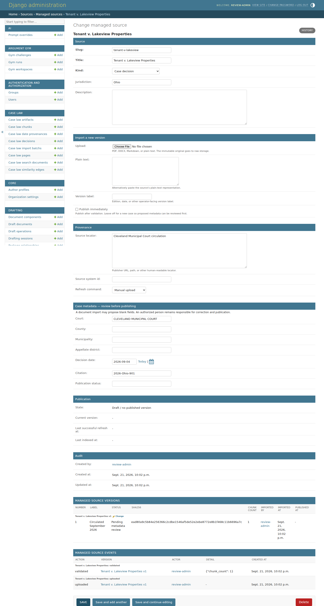
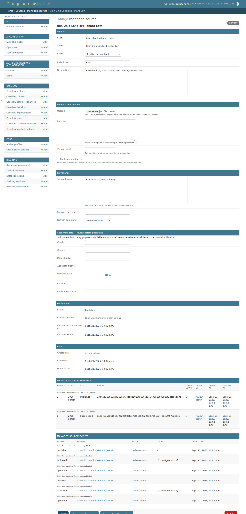
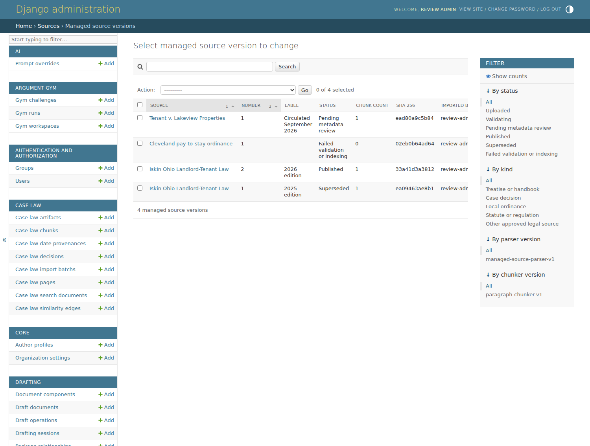

# Legal content maintenance

Authorized staff can maintain a treatise, local decision, ordinance, statute, or
other approved legal source at **Django admin → Sources → Managed sources**.
This workflow is for source documents and their faithful plain-text
representations. It does not replace the reviewed, file-backed rules under
`content/`.

## Add or update a source

1. Add a managed source, give it a stable lowercase slug, and choose its kind.
2. Upload a PDF/DOCX/text file, or paste UTF-8 plain text. Add the official
   publisher URL or other source locator whenever one exists.
3. For a newly circulated case, leave **Publish immediately** off. The importer
   proposes only metadata it can identify conservatively (caption, court,
   public-domain citation, and decision date). Review and correct the dedicated
   case fields on the source page.
4. Open the validated version and use **Publish selected validated versions**.
   The source is then visible in research. Search results carry the source and
   chunk checksums, version ID, locator, and published manifest key.

An identical upload is a no-op. A changed upload creates an immutable new
version; publishing it supersedes the old live version without deleting its
audit history. A scanned PDF with no readable text fails validation: upload an
OCR/plain-text representation rather than publishing an empty source.

Validation runs in the background, so a large document does not hold the
request open. A version that failed, or whose worker never finished, is
retried by uploading the same file again: an import that never ran is recorded
as failed with its reason rather than left looking like work in progress. A
version still being validated is left alone, and reported as such, until it is
stale enough that no worker can still be on it.

## Retire or restore

Use **Retire selected sources from research** to remove a source from active
retrieval. Its files, versions, and event history remain. To restore it, publish
the desired version. To return to an older edition, select that version and use
**Roll each source back to the selected version**.

The source page shows the current version, checksum, last successful refresh,
last indexing time, validation failures, and an event log identifying the user
who uploaded, validated, published, retired, or rolled back content.

## Automation

The same pipeline is available without the admin:

```bash
.venv/bin/python backend/manage.py manage_content_source import iskin-treatise /secure/iskin.pdf \
  --kind treatise --title "Iskin Treatise" --label "2026 edition" --username operator

# After review:
.venv/bin/python backend/manage.py manage_content_source publish iskin-treatise --source-version 1 --username operator
.venv/bin/python backend/manage.py manage_content_source retire iskin-treatise --username operator
.venv/bin/python backend/manage.py manage_content_source rollback iskin-treatise --source-version 1 --username operator
```

Add `--publish` to an import whose metadata has already been reviewed. Commands
return a non-zero exit for invalid files and never move the live pointer on a
failed validation or storage write.

## Storage lifecycle and providers

Every provider has three isolated areas:

```text
raw/managed-sources/...        immutable uploaded originals
validated/managed-sources/...  manifest and chunks which passed validation
published/managed-sources/...  artifacts for the live/version history
```

The database's `current_version` is the atomic publication pointer. Retrieval
selects chunks only through that pointer, so an interrupted upload or partial
publication cannot expose mixed versions.

Local development and the existing Azure Files deployment use
`DOCUMENT_STORAGE_BACKEND=filesystem`. Native Azure Blob Storage is configured
with `DOCUMENT_STORAGE_BACKEND=azure_blob`, a container, and either a connection
string or account URL plus credential. AWS S3 and compatible providers use the
`s3` backend. Provider credentials belong only in `.env` or the deployment's
secret store.

Grant staff the normal Django view/add/change permissions for managed sources
and versions. Publication should be limited to content administrators (the
`sources.publish_managedsource` permission); superusers receive it implicitly.

## Screenshots

The source catalog puts publication state, current version, checksum, and index
freshness in one operator-facing list:


A newly uploaded decision remains out of research while an administrator
reviews the proposed court, citation, and decision date:



Treatise updates retain their complete immutable version and event history:



The version list provides explicit publish and rollback actions:


